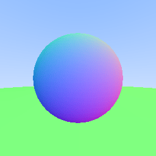

# RayTracing

A C++ implementation of a ray tracer

## Project Evolution

### Phase 1: The Foundation (Output & Math)
Started by establishing the basic tools to generate images and handle 3D math.
* **PPM Image Format:** Implemented a simple text-based image writer (`P3` format).
* **Vec3 Library:** Created a `vec3` class to handle 3D coordinates $(x, y, z)$ and RGB colors.
* **Math Operations:** Implemented vector addition, scalar multiplication, dot products, and unit vector normalization.

### Phase 2: The Camera & Background
Defined "sight" by creating rays and a background gradient.
* **The Ray Class:** modeing light rays using the linear function $P(t) = A + tb$, where $A$ is the origin and $b$ is the direction.
* **Linear Interpolation (Lerp):** Created a "blue sky" background by blending white and blue based on the ray's Y-direction.
    * *Formula:* `color = (1.0 - t) * white + t * blue`

### Phase 3: The First Object (Sphere)
Introduced solid geometry using mathematical intersection.
* **Sphere Equation:** Used the implicit equation $(x - C)^2 + y^2 + z^2 = r^2$ to detect collisions.
* **The Discriminant:** Solved the quadratic formula to determine *if* a ray hits a sphere.
* **Surface Normals:** Calculated the normal vector at the hit point to visualize the curvature of the sphere (mapping normal values -1..1 to color values 0..1).

### Phase 4: Engine Refactor (Abstraction)
Moved away from hard-coded math in `main.cpp` to a flexible, object-oriented system.
* **`hittable.h`:** Defined an abstract base class (interface) with a pure virtual `hit` function.
* **`hit_record`:** Created a struct to bundle collision data (point `p`, `normal`, and `t` distance) to pass back to the renderer.
* **`sphere.h`:** Refactored sphere logic into its own class inheriting from `hittable`.
* **`hittable_list.h`:** Implemented a generic container to store and process a list of multiple objects, automatically finding the closest hit.

## Current Status
The engine currently renders a scene containing:
1.  **A Center Sphere:** Rendered with surface normal coloring.
2.  **A Floor:** Simulated using a massive sphere (Radius 100) positioned just below the camera view.

Here is the output produced (Converted from ppm to png for display):



## 🚀 How to Run

The project uses standard C++ (no external dependencies).

1.  **Compile:**
    ```bash
    g++ main.cpp -o raytracer
    ```

2.  **Run:**
    ```bash
    ./raytracer > image.ppm
    ```
    *(Note: Output is redirected to a .ppm file)*

3.  **View:**
    Open `image.ppm` in any compatible viewer (e.g., Photoshop, GIMP, or online PPM viewers).

## 🔮 Future Roadmap

* **Antialiasing**: Implementing multi-sampling per pixel to eliminate jagged edges.
* **Camera System**: Abstracting the camera to support position changes, look-at targets, and FOV adjustments.
